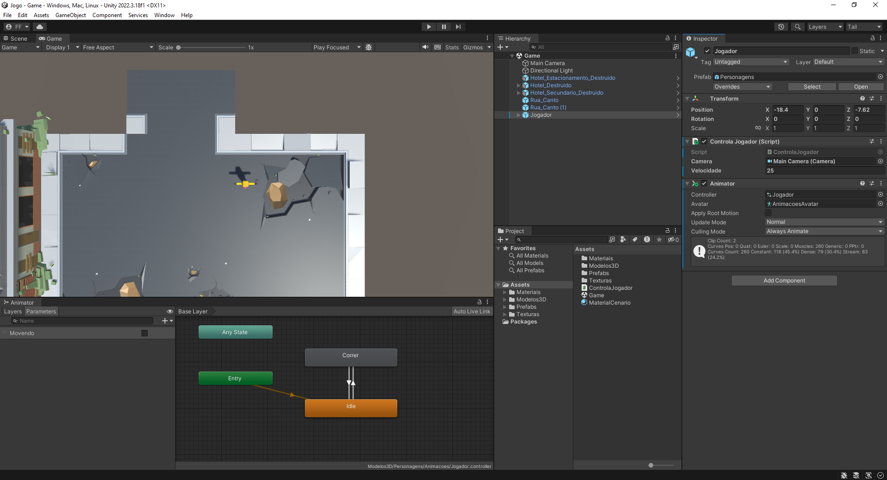

# INF03035 - Introdução ao Desenvolvimento de Jogos

Este repositório tem como objetivo apoiar as aulas da referida disciplina do curso de Bacharel em Sistemas de Informação do IF Sudeste MG - Campus Manhuaçu.

